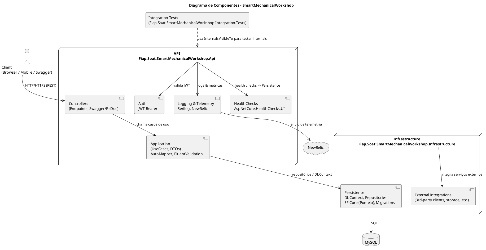
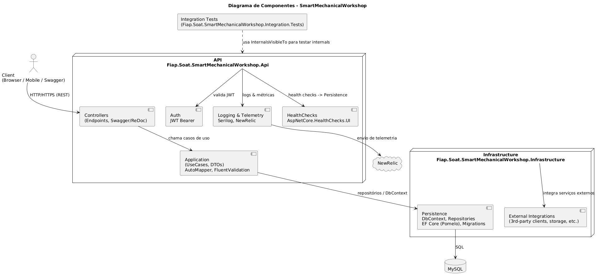

# Smart Mechanical Workshop - Sistema de Gestão para Oficina Mecânica

[](https://sonarcloud.io/summary/new_code?id=igortessaro_fiap-soat-oficina-mecanica)
[](https://sonarcloud.io/summary/new_code?id=igortessaro_fiap-soat-oficina-mecanica)
[](https://sonarcloud.io/summary/new_code?id=igortessaro_fiap-soat-oficina-mecanica)
[](https://sonarcloud.io/summary/new_code?id=igortessaro_fiap-soat-oficina-mecanica)
[](https://sonarcloud.io/summary/new_code?id=igortessaro_fiap-soat-oficina-mecanica)
[](https://sonarcloud.io/summary/new_code?id=igortessaro_fiap-soat-oficina-mecanica)
[](https://sonarcloud.io/summary/new_code?id=igortessaro_fiap-soat-oficina-mecanica)

## Sobre o Projeto

O **Smart Mechanical Workshop** é um sistema completo de gestão para oficinas mecânicas de médio porte, desenvolvido para otimizar e modernizar os processos de manutenção de veículos. O sistema oferece uma solução integrada que gerencia desde o cadastro de clientes e veículos até o controle de estoque, orçamentos, ordens de serviço e relatórios de performance.

### Principais Funcionalidades

- **Gestão de Clientes**: Cadastro completo de clientes com dados pessoais e de contato
- **Gestão de Veículos**: Registro detalhado de veículos vinculados aos clientes
- **Controle de Serviços**: Catálogo de serviços disponíveis com preços e materiais necessários
- **Gestão de Estoque**: Controle de insumos e materiais utilizados nos serviços
- **Orçamentos**: Criação e gerenciamento de orçamentos para os clientes
- **Ordens de Serviço**: Controle completo do ciclo de vida dos serviços executados
- **Autenticação JWT**: Sistema seguro de autenticação para funcionários
- **Relatórios**: Análise de tempo médio de execução de serviços e performance geral

## Overview Técnico

### Arquitetura

O projeto segue os princípios de **Clean Architecture** e **Domain-Driven Design (DDD)**, organizados em camadas bem definidas:

```
src/
├── Fiap.Soat.SmartMechanicalWorkshop.Api/          # Camada de Apresentação (Web API)
├── Fiap.Soat.MechanicalWorkshop.Application/       # Camada de Aplicação (CQRS/MediatR)
├── Fiap.Soat.SmartMechanicalWorkshop.Domain/       # Camada de Domínio (Entidades, VOs)
└── Fiap.Soat.SmartMechanicalWorkshop.Infrastructure/ # Camada de Infraestrutura (EF Core)
```

### Tecnologias e Dependências

#### Framework Base

- **.NET 9.0** - Framework principal da aplicação
- **ASP.NET Core** - Framework web para APIs REST

#### Banco de Dados

- **Entity Framework Core 8.0** - ORM para acesso a dados
- **Pomelo.EntityFrameworkCore.MySql** - Provider para MySQL
- **MySQL 8.4** - Sistema de gerenciamento de banco de dados

#### Arquitetura e Padrões

- **MediatR** - Implementação do padrão Mediator para CQRS
- **AutoMapper** - Mapeamento automático entre objetos
- **FluentResults** - Tratamento de resultados de operações
- **FluentValidation** - Validação de dados de entrada

#### Autenticação e Segurança

- **JWT Bearer Authentication** - Autenticação baseada em tokens JWT

#### Documentação e Testes

- **Swagger/OpenAPI** - Documentação interativa da API
- **xUnit** - Framework de testes unitários
- **AutoFixture** - Geração automática de dados para testes

#### Logging e Monitoramento

- **Serilog** - Sistema de logging estruturado

#### Comunicação

- **MailHog** - Servidor SMTP para desenvolvimento e testes de e-mail

### Estrutura de Pastas

```
fiap-soat-oficina-mecanica/
├── src/                                    # Código fonte da aplicação
│   ├── Api/                               # Controladores e configurações da Web API
│   ├── Application/                       # Handlers, Commands e Notifications
│   ├── Domain/                           # Entidades, Value Objects e Contratos
│   └── Infrastructure/                   # Implementações de repositórios e serviços
├── tests/                                # Projetos de testes
│   ├── Domain.Tests/                     # Testes unitários do domínio
│   ├── Integration.Tests/                # Testes de integração
│   └── Tests.Shared/                     # Utilitários compartilhados para testes
├── docker/                               # Scripts e configurações do Docker
│   └── mysql/init/                       # Scripts de inicialização do banco
├── postman/                              # Coleções do Postman para testes de API
└── docker-compose*.yml                   # Configurações do Docker Compose
```

## Como Executar o Projeto

### Pré-requisitos

#### Para execução com Docker (Recomendado)

- **Docker Desktop** ou **Docker Engine** (versão 20.10+)
- **Docker Compose** (versão 2.0+)

#### Para execução com Kubernetes

- **Kubernetes cluster** (minikube, kind, EKS, GKE, AKS, etc.)
- **kubectl** (versão 1.25+)
- **Kustomize** (incluído no kubectl 1.14+)

#### Para desenvolvimento local

- **.NET SDK 9.0** ou superior
- **MySQL 8.0** ou superior
- **Git** para controle de versão

### Opção 1: Ambiente Completo (Produção)

Esta opção executa toda a aplicação incluindo API, banco de dados e MailHog:

```bash
# Clonar o repositório
git clone https://github.com/igortessaro/fiap-soat-oficina-mecanica.git
cd fiap-soat-oficina-mecanica

# Executar ambiente completo
docker compose -f docker-compose.yml -p "fiap-smart-mechanical-workshop" up --build -d
```

**Serviços disponíveis:**
- API: http://localhost:5180
- Swagger: http://localhost:5180/swagger
- MailHog: http://localhost:8025
- MySQL: localhost:3306

### Opção 2: Ambiente de Desenvolvimento

Esta opção executa apenas o banco de dados e MailHog, permitindo executar a API localmente para desenvolvimento:

```bash
# Executar apenas infraestrutura
docker compose -f docker-compose.dev.yml -p "fiap-smart-mechanical-workshop-dev" up --build -d

# Em outro terminal, executar a API localmente
cd src/Fiap.Soat.SmartMechanicalWorkshop.Api
dotnet run
```

**Configuração de banco local:**

```json
"ConnectionStrings": {
  "DefaultConnection": "server=localhost;port=3306;database=workshopdb;user=workshopuser;password=workshop123;SslMode=none;AllowPublicKeyRetrieval=True;"
}
```

**Serviços disponíveis:**

- API: https://localhost:7286 (HTTPS) ou http://localhost:5287 (HTTP)
- MailHog: http://localhost:8025
- MySQL: localhost:3306

```bash
# Parar ambiente completo
docker compose -p "fiap-smart-mechanical-workshop" down

# Parar ambiente de desenvolvimento
docker compose -f docker-compose.dev.yml -p "fiap-smart-mechanical-workshop-dev" down
```

### Opção 3: Deploy no Kubernetes

Para deployar a aplicação em um cluster Kubernetes, utilize nossa infraestrutura configurada com Kustomize:

```bash
# Navegar para o diretório k8s
cd k8s

# Deploy para development
./deploy.sh development

# Deploy para staging
./deploy.sh staging

# Deploy para production
./deploy.sh production

# Verificar status dos serviços
./status.sh development
```

**📖 Para instruções detalhadas de Kubernetes, consulte: [k8s/README.md](k8s/README.md)**

A infraestrutura Kubernetes inclui:

- **Multi-ambiente**: Development, Staging e Production
- **Auto-scaling**: HPA baseado em CPU
- **LoadBalancer**: Exposição externa automática
- **Persistent Storage**: Para dados do MySQL
- **Ingress**: HTTPS para produção
- **Monitoramento**: Scripts de debug e status

## Gerenciamento de Migrations do Banco de Dados

O projeto utiliza **Entity Framework Core** para gerenciar as migrations do banco de dados. Siga os passos abaixo para trabalhar com migrations:

### Pré-requisitos(Migrations)

Instale a ferramenta global do Entity Framework (caso ainda não tenha):

```bash
dotnet tool install --global dotnet-ef
```

### Criar uma Nova Migration

Execute o comando abaixo na raiz do projeto, substituindo `NOME_DA_MIGRATION` pelo nome desejado:

```bash
dotnet ef migrations add NOME_DA_MIGRATION \
  --project src/Fiap.Soat.SmartMechanicalWorkshop.Infrastructure \
  --startup-project src/Fiap.Soat.SmartMechanicalWorkshop.Api
```

**Parâmetros:**

- `--project`: Indica onde estão as classes de contexto e migrations
- `--startup-project`: Indica onde está o projeto de inicialização (API)

### Aplicar Migrations no Banco

```bash
dotnet ef database update \
  --project src/Fiap.Soat.SmartMechanicalWorkshop.Infrastructure \
  --startup-project src/Fiap.Soat.SmartMechanicalWorkshop.Api
```

### Desfazer a Última Migration

Para remover a última migration (antes de aplicá-la no banco):

```bash
dotnet ef migrations remove \
  --project src/Fiap.Soat.SmartMechanicalWorkshop.Infrastructure
```

### Dicas Importantes

- Sempre confira se as entidades e configurações do DbContext estão corretas antes de criar uma migration
- Para Value Objects (como Phone ou Address), configure-os como tipos próprios (owned types) no método `OnModelCreating`
- As migrations são aplicadas automaticamente quando o container Docker é iniciado

## Servidor de E-mail para Desenvolvimento (MailHog)

O **MailHog** é uma ferramenta de desenvolvimento que simula um servidor SMTP e fornece uma interface web para visualizar e-mails enviados pela aplicação. É ideal para testar funcionalidades de e-mail sem enviar mensagens reais.

### Características do MailHog

- **Captura todos os e-mails** enviados pela aplicação
- **Interface web intuitiva** para visualização das mensagens
- **Não envia e-mails reais** - funciona apenas para desenvolvimento/teste
- **Suporte completo a HTML e anexos**

### Como Usar

1. **Acesso à Interface Web**: Após executar o Docker Compose, acesse [http://localhost:8025](http://localhost:8025)
2. **Visualização em Tempo Real**: Todos os e-mails enviados pela aplicação aparecerão automaticamente na interface
3. **Detalhes das Mensagens**: Clique em qualquer e-mail para ver conteúdo, headers e anexos

### Documentação Oficial

Para mais informações sobre configuração e uso avançado, consulte a [documentação oficial do MailHog](https://github.com/mailhog/MailHog).

## Sistema de Autenticação

A aplicação utiliza **autenticação JWT (JSON Web Token)** para proteger todos os endpoints da API. Todos os endpoints requerem um token válido para acesso.

### Como Obter o Token

1. **Endpoint de Login**: `POST /auth/login`
2. **Credenciais Necessárias**:
   - **E-mail**: Use qualquer e-mail da tabela `people` com perfil "Employee"
   - **Senha**: Para todos os usuários cadastrados, a senha descriptografada é `Pa$$w0rd!`

### Exemplos de Credenciais Disponíveis

| E-mail | Perfil | Senha |
|--------|--------|-------|
| <joao.silva@email.com> | Employee | Pa$$w0rd! |

### Exemplo de Requisição de Login

```bash
curl --location 'http://localhost:5180/auth/login' \
--header 'Content-Type: application/json' \
--header 'Authorization: Bearer eyJhb...' \
--data-raw '{
  "email": "joao.silva@email.com",
  "password": "Pa$$w0rd!"
}'
```

### Resposta de Sucesso

```json
{
    "isSuccess": true,
    "data": "eyJhbGci...",
    "reasons": []
}
```

### Como Usar o Token

#### No Swagger

1. Faça login usando o endpoint `/auth/login`
2. Copie o token retornado
3. Clique no botão **"Authorize"** no topo da página do Swagger
4. Digite `Bearer {seu_token}` no campo de autorização
5. Todos os endpoints protegidos agora funcionarão automaticamente

#### Em Requisições HTTP

Adicione o header de autorização em todas as requisições:

```bash
curl -X GET "http://localhost:5180/api/v1/serviceorders/search" \
  -H "Authorization: Bearer {seu_token}"
```

## 📚 Documentação Adicional

Este projeto conta com documentação detalhada em diferentes áreas. Consulte os arquivos abaixo para informações específicas:

### 🚀 Deploy e Infraestrutura

- **[DEPLOY_GUIDE.md](DEPLOY_GUIDE.md)** - Guia completo de deploy com GitHub Actions e métodos manuais. Inclui configuração de secrets, workflows automáticos e deploy em AWS com EKS.

- **[terraform/README.md](terraform/README.md)** - Documentação da infraestrutura Terraform para AWS. Contém instruções para criação de VPC, EKS, RDS e configuração de ambientes.

### ☸️ Kubernetes

- **[k8s/README.md](k8s/README.md)** - Infraestrutura completa do Kubernetes com Kustomize. Documentação para deploy em múltiplos ambientes (development, staging, production) com auto-scaling e LoadBalancers.

- **[k8s/deploy_instructions.md](k8s/deploy_instructions.md)** - Instruções rápidas de deploy para Kubernetes. Comandos essenciais para fazer deploy nos diferentes ambientes.

### 🤖 GitHub Actions

- **[.github/workflows/README.md](.github/workflows/README.md)** - Documentação completa dos workflows do GitHub Actions. Inclui configuração de secrets AWS, workflows de deploy automático, destruição de infraestrutura e troubleshooting.

### 📋 Resumo por Categoria

| Categoria | Arquivo | Propósito |
|-----------|---------|-----------|
| **Deploy Geral** | [DEPLOY_GUIDE.md](DEPLOY_GUIDE.md) | Guia principal de deploy com todas as opções |
| **Infraestrutura** | [terraform/README.md](terraform/README.md) | Configuração e gestão da infraestrutura AWS |
| **Kubernetes** | [k8s/README.md](k8s/README.md) | Deploy e configuração completa do Kubernetes |
| **Kubernetes Rápido** | [k8s/deploy_instructions.md](k8s/deploy_instructions.md) | Comandos rápidos para deploy K8s |
| **CI/CD** | [.github/workflows/README.md](.github/workflows/README.md) | Automação com GitHub Actions |

## Diagrama de Componentes

Descrição: o diagrama abaixo mostra os principais componentes do sistema seguindo a arquitetura em camadas (API, Application, Domain e Infrastructure). Ele ajuda a entender responsabilidades e fluxos entre controladores, casos de uso, persistência e integrações externas.

Para renderizar: copie o bloco PlantUML para a extensão PlantUML do VS Code ou cole em https://www.plantuml.com/plantuml.





Fonte: [diagrama-componentes.puml](docs/diagrams/diagrama-componentes.puml)

## RFCs — Decisões Técnicas

Este projeto documenta decisões arquiteturais e operacionais relevantes através de RFCs (Request for Comments). Abaixo estão as RFCs iniciais que descrevem as escolhas de nuvem, banco de dados e estratégia de autenticação.

- `docs/rfcs/0001-cloud-choice.md` — Escolha da Nuvem (AWS / EKS / RDS)
- `docs/rfcs/0002-database-choice.md` — Escolha do Banco de Dados (MySQL / RDS)
- `docs/rfcs/0003-auth-strategy.md` — Estratégia de Autenticação (JWT Bearer)

Recomendação: antes de alterações significativas na infra (mudança de provedor de nuvem, tipo de banco ou estratégia de autenticação), abra um novo RFC e registre alternativas, impacto e plano de rollback.

Template: para facilitar a criação de novas RFCs, há um template em `docs/rfcs/TEMPLATE.md` — copie e preencha seguindo o padrão de título `0004-descricao.md`.

## ADRs — Architecture Decision Records

Decisões arquiteturais permanentes ou de alto impacto são registradas como ADRs. Seguem as ADRs iniciais:

- `docs/adr/0001-communication-pattern.md` — Padrão de Comunicação (REST público + event-driven interno)
- `docs/adr/0002-hpa.md` — Escalonamento (HPA e métricas)
- `docs/adr/TEMPLATE.md` — Template para novos ADRs

Recomendação: antes de mudanças arquiteturais permanentes, registre uma ADR descrevendo contexto, alternativas, decisão e plano de rollback.

## Saga Pattern - Arquitetura Event-Driven com Coreografia

O projeto implementa uma **arquitetura orientada a eventos (Event-Driven Architecture)** com **padrão de coreografia**, que são os fundamentos do Saga Pattern para gerenciar transações distribuídas entre microsserviços.

### Componentes da Arquitetura

#### 1. Message Broker (RabbitMQ)

O sistema utiliza RabbitMQ como broker de mensagens para comunicação assíncrona entre serviços:

- **Exchanges configurados**:
  - `database.events.exchange` - Eventos de mudanças no banco de dados
  - `notifications.exchange` - Notificações de ordem de serviço

- **Padrão Topic Exchange**: Roteamento dinâmico baseado em routing keys (ex: `database.INSERT.ServiceOrder`)

- **Persistência de mensagens**: Todas as mensagens são persistentes para garantir durabilidade

#### 2. Serviços Independentes com Responsabilidades Específicas

**API Principal** (`smart-mechanical-workshop-api`):
- Expõe endpoints REST para clientes externos
- Publica eventos de mudanças de estado via `DatabaseEventInterceptor`
- Publica notificações quando ordens de serviço são concluídas

**Audit Log Worker** (`smart-mechanical-workshop-auditlog-worker`):
- Consome eventos de `database.events.exchange`
- Persiste logs de auditoria no MongoDB de forma assíncrona
- Desacoplado da API principal

**Survey API** (`smart-mechanical-workshop-survey-api`):
- Consome notificações de `notifications.exchange`
- Envia pesquisas de satisfação quando ordens são entregues
- Gerencia seu próprio banco de dados MongoDB

#### 3. Padrão de Coreografia

**Sem orquestrador central**: Cada serviço reage independentemente aos eventos que lhe interessam:

```
ServiceOrder.Delivered (API)
    ↓
[RabbitMQ - notifications.exchange]
    ↓
Survey API → Envia pesquisa de satisfação
```

**Vantagens da coreografia implementada**:
- Alto desacoplamento entre serviços
- Escalabilidade independente de cada serviço
- Tolerância a falhas (se um serviço cai, outros continuam funcionando)
- Fácil adição de novos consumidores sem modificar publicadores

#### 4. State Machine para Ordens de Serviço

O domínio implementa uma máquina de estados robusta para gerenciar o ciclo de vida das ordens de serviço:

**Estados disponíveis**:
1. `Received` → `UnderDiagnosis`
2. `UnderDiagnosis` → `WaitingApproval` ou `Cancelled`
3. `WaitingApproval` → `InProgress`, `Rejected` ou `Cancelled`
4. `InProgress` → `Completed`
5. `Completed` → `Delivered`
6. `Cancelled` → `Delivered`
7. `Rejected` → `WaitingApproval`

**Implementação**:
- Padrão State Pattern com classes de estado específicas (ex: `ReceivedState`, `InProgressState`)
- Validação de transições permitidas em cada estado
- Exceções de domínio para transições inválidas

#### 5. Event Sourcing Parcial

O sistema mantém histórico de eventos de ordens de serviço:

- Tabela `service_order_events` registra todas as mudanças de estado
- Handler `CreateEventLogHandler` persiste eventos automaticamente
- Permite auditoria e análise de fluxo de trabalho

### Fluxo de Exemplo: Conclusão de Ordem de Serviço

```
1. Cliente aprova orçamento via API
   ↓
2. Quote.Status → Approved
   ↓
3. UpdateQuoteStatusHandler publica UpdateQuoteStatusNotification
   ↓
4. ReplacementStockHandler atualiza estoque (reage ao evento)
   ↓
5. ServiceOrder.Status → InProgress
   ↓
6. ... (trabalho executado) ...
   ↓
7. ServiceOrder.Status → Completed → Delivered
   ↓
8. NotifyServiceOrderCompletionHandler publica mensagem no RabbitMQ
   ↓
9. Survey API consome mensagem
   ↓
10. E-mail de pesquisa enviado ao cliente
```

### Benefícios da Implementação

✅ **Desacoplamento**: Serviços não conhecem uns aos outros diretamente

✅ **Escalabilidade**: Cada serviço pode escalar independentemente conforme demanda

✅ **Resiliência**: Falha em um serviço não afeta os demais

✅ **Extensibilidade**: Novos serviços podem ser adicionados apenas consumindo eventos existentes

✅ **Rastreabilidade**: Todos os eventos são auditados e armazenados

✅ **Separação de concerns**: Cada serviço tem sua própria base de dados e responsabilidade
